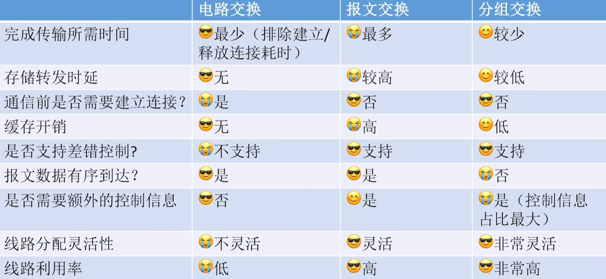

# 第一章 计算机网络体系结构

> 概念 框架
>
> 选择 简单计算

## 1.1.1 计算机网络的概念

> 1. 什么是计算机网络
> 2. 计算机网络 互联网 互连网的区别
>
> 

### 什么是计算机网络

computer networking

计算机网络是一个将众多**分散的，自治的**计算机系统，通过**通信设备**与**线路**连接起来，由**功能完善的软件**实现资源共享和信息传递的系统。

### 计算机网络 互联网 互连网的区别

- 计算机网络（网络）

  - 由若干结点（node）和连接这些结点的链路（link）组成

    - 结点：计算机 集线器hub 交换机switch 路由器router

    - 链路：有线链路 无线链路

      1. 集线器（hub）：可以把多个结点连接起来，组成一个计算机网络

         - 普通民用领域很少用集线器

         - 集线器工作在物理层

      2. 交换机（switch）：可以把多个结点连接，组成一个计算机网络

         - 家庭 公司 学校用交换机组件内部网络

         - 交换机工作在数据链路层

      3. 路由器（router）：可以把两个或多个计算机网络互相连接，形成规模更大的计算机网络，称为“互连网”

         - 工作在网络层

      4. > 家用路由器：路由器+交换机+其他功能
         > 也就是我的手机投屏到电视上 依靠家用路由器的交换机功能 这属于家庭内部的网络；访问其他网页属于路由器的功能，把我家的网络和外部连接

- 互连网
- 互联网
  - ISP internet service provider：互连网服务提供商，如中国电信/移动/联通
  - 互联网/因特网：由各大ISP和国际机构组建的，覆盖全球范围的互连网。
  - 互联网必须使用**TCP/IP协议**通信，而互连网可以用任意协议通信
    - TCP/IP协议

## 1.1.2 计算机网络的组成和功能

> 

### 计算机网络的组成

#### 从组成部分看

网卡+软件

#### 从工作方式看

#### 从逻辑功能看

通信子网：通信设备和介质

主机部分实现网络通信的底层硬件/软件也是通信子网的范畴

### 计算机网络的功能

## 1.1.3 电路交换 报文交换 分组交换

> 

### 电路交换

- 通过物理线路的连接，动态地分配传输线路资源
- 优缺点
  - 传输速率高：适合低频次，大量传输数据
    - but计算机之间传数据是少量高频次
  - 
  - 建立/释放连接开销高
  - 线路被独占，利用率低
  - 线路分配灵活性差
  - 交换节点不支持差错控制

### 报文交换

- message：报文

  

- **存储转发**思想：把传送到数据单元先存储到中间结点，再根据目的地址转发到下一节点

- 优缺点

  - 通信前无需连接
  - 存储转发 通信线路分配更灵活
  - 线路利用率高
  - 支持差错控制
  - 
  - 报文不定长 不方便存储转发管理
  - 长报文的缓存开销大 存储转发时间开销大
  - 长报文容易出错，重传代价高

### 分组交换

路由器→分组交换机

- 优缺点
  - 报文交换的优点
  - 分组定长 方便存储转发管理
  - 分组的存储转发时间开销小 缓存开销小
  - 分组不易出错 重传代价低
  - 
  - 控制信息的占比增加了 需要消耗更多资源传送控制信息
  - 存在存储转发时延
  - 报文被拆分成多个分组 传输中出现失序 丢失问题 增加处理的复杂度
    - 虚电路交换技术？

### 电路交换 报文交换 分组交换的性能对比

### 电路交换性能分析

传送完数据就可以立即发送释放信号

传播时延：从一个节点传送数据到另一个结点的时间

### 报文交换性能分析

### 分组交换性能分析

 

## 1.1.4 计算机网络的分类

> 

### 分布范围

- 广域网WAN
- 城域网MAN
- 局域网LAN
  - 以太网技术
- 个域网PAN
  - 无线技术连接个人设备 蓝牙

### 传输技术

广播式网络

- 广播范围的所有计算机都收到该分组，再检查分组的目的地址决定是否接收

点对点网络

- 精准送达

### 拓扑结构

##### 总线形结构

- 数据广播式传输 “总线争用”
  - 典型代表：集线器连接的设备

##### 环形结构

- 数据广播式传输 
- 令牌解决总线争用问题

##### 星形结构

- 点对点传输
- 不存在总线争用问题
  - 

- 以太网交换机连接的设备

##### 网状结构

- 数据通过各中间节点逐一存储转发 点对点
- 代表：由路由器构建的**广域网**

### 使用者

公用网

专用网

- 组织内部

### 传输介质

有线网络

无线网络

## 1.1.5 计算机网络的性能指标

> 

### 速率

#####  速率

- 连接到网络上的节点在信道上传输数据的速率
  - 数据率，比特率，数据传输速率
  - 信道：向某一方向传送信息的通道≠通信线路 （一条通信线路在逻辑上对应一条发送信道 一条接收信道）

- 速率单位：bit/s b/s bps
  - k M G T（10）
  - 通信跟存储的单位换算不一样

### 带宽

##### 带宽

- 某信道能传送的**最高数据率**

- 节点间通信实际能达到的最高速率由带宽 节点性能共同限制

### 吞吐量

##### 吞吐量

- 单位时间内通过某个网络（信道/接口）的实际数据量
- 受带宽限制 受复杂的网络负载情况影响

---

### 时延

##### 时延

- 数据从网络的一端传送到另一 端所需的时间
- 延迟/迟延
- 计算

### 时延带宽积

##### 时延带宽积

- 实验带宽积 = 传播时延 * 带宽
- 含义：一条链路中已从发送端发出但尚未到达接收端的最大比特数（水管内部的水量 ）

### 往返时延

##### 往返时延

- 表示从发送方**发送完数据**，到发送方收到来自接收方的**确认**总共经历的时间
- 往返时延 RTT = t2 + t3 + t4 + t5

### 信道利用率

##### 信道利用率

- 某个信道有百分之多少的时间是有数据通过的

- 计算公式

- 网络利用率？

- > 信道利用率不能太低，浪费资源
  > 信道利用率不能太高，网络拥塞

## 1.2.1 计算机网络分层结构

> 
>

### “分层”的设计思想

##### 快递网络

- 分层设计思想：将庞大而复杂的问题，转化为若干较小的局部问题
- 设计并不唯一 可根据实际需求增加或减少层次
- 同一个功能可以在多个层次重复出现
  - 货物打包
  - 取件 派件
  - 冷链运输
  - 包裹“路由”
  - 运输包裹
  - ...
- 四层体系结构

##### 计算机网络

- OSI参考模型
- TIP/IP模型
- 五层模型

##### 网络体系结构的概念

- 网络体系结构是计算机网络的各层及其协议的集合，就是这个计算机网络及其构件所应完成的功能的精确定义（不涉及实现）。
- 实现implementation 是遵循这种体系结构的前提下，用何种硬件或软件完成这些功能的问题。
- 体系结构是抽象的，而实现则是具体的

##### 各层之间的关系

- **实体**：第n层的活动元素
- **协议**：对等实体之间通信的规则集合
- **接口**：相邻两层的实体交换信息的逻辑接口，又称为服务访问点SAP
- **服务**：下层给相邻上层提供的功能调用

---

### 数据的传输过程

##### 水平视角

##### 垂直视角

- PDU 协议数据单元
  - 对等层次之间传送的数据单位
  - n-PDU
- SDU 服务数据单元
  - 为完成上一层实体所要求的功能而传送的数据
- PCI   协议控制信息
  - 控制协议操作的信息
- n-SDU + n-PCL = n-PDU = (n-1)-SDU

### 协议三要素

##### 协议

- 网络协议：控制对等实体之间进行通信的规则的集合，水平的
- 语法
  - 数据与控制信息的格式
- 语义
  - 发出何种控制信息 完成何种动作 做出何种应答
- 同步/时序
  - 执行各种操作的条件 时序关系等
  - 事件实现顺序的详细说明

## 1.2.3 OSI参考模型与TCP/IP模型

### OSI参考模型

> 
>

---

### TCP/IP模型

> 

- 应用层
- 传输层
- 网络层
- 网络接口层

# 第二章 物理层

## 2.1.1 通信基础的基本概念

> 

- 码元：每一个信号是一个码元
  - 可以把信号周期称为码元宽度
    - 四进制码元：一个码元可能有四种状态
    - 八进制码元 3bit
  - 1码元 = log 2 K bit
- 速率
  - **波特率**: 每秒传输几个码元 码元/s 或者 波特
  - 比特率: 每秒传输几个比特bps
    - **关注一个码元携带几个比特**

## 2.1.2 信道的极限容量

> 
>
> **奈奎斯特定理**
> **香农定理**

### 带宽

- 计网
  - 信道能通过的最高数据率
- 通信原理
  - <u>信道允许通过的信号频带范围</u>

### 噪声

- 对信道产生干扰，影响信道的数据传输效率

### 奈奎斯特定理

- 对于一个<u>**理想低通信道**</u>（**没有噪声**，带宽有限的信道）：==**极限波特率 = 2W（单位波特）**==
  - W：信道的频率带宽
  - 极限比特率=2W * log2 K
- 说明
  - 

### 香农定理

- 对于一个**有噪声**，带宽有限的信道：

  **==极限比特率=Wlog~2~(1 + S/N)(单位b/s)==**

  - 信噪比 S/N = 信号的功率 / 噪声的功率
  - but 信噪比作为一个比值会很大，所以我们用dB 
    - 10log~10~S/N
    - 记得用香农定理要把信噪比改成无单位的记法

##  2.1.3 编码和调制

> 
>

### 概念

### 常用编码方式

 自同步能力：信源和信宿可以根据信号完成节奏同步?无需时钟信号

- 差分：中间 下1上0
- 不差分：起点 不变1变0
- 归零：低0高1
- 不归零：低0高1
- 反向非归零：起点 不变1变0

---

### 常见的调制方法

基带信号：来自信源的数字信号，需调制后才能在某些信道上运输

正交幅度调制QAM AM+PM

以太网的默认使用曼彻斯特编码

## 2.2 传输介质

> 
>

### 常用传输介质

#### 双绞线

- 绞合
- 屏蔽层
  - STP 有屏蔽
  - UTP 无屏蔽

提高绞合度，增加屏蔽层->抗电磁干扰能力强，信道噪声功率低，信道极限速率高

#### 同轴电缆

- 内导体+外导体屏蔽层
  - 早期局域网 早期有线电视

#### 光纤

- 纤芯（高折射率）+ 薄层（低折射率）
- 光的全反射
- 分类
  - 单模
    - 直径小于一个波长 只能传输一条光线
    - 近距离
  - 多模
    - 纤芯更粗 可同时传输多条光线
    - 远距离

#### 以太网对有线传输介质的命名规则

速度 + Base + 介质信息

Baseband：基带传输 即传输数字信号 采用曼彻斯特编码

- 10base5   10Mbps 同轴电缆 最远传输距离500m
- 10base2   10Mbps 同轴电缆 最远传输距离200m
- 10baseF* 10Mbps 光纤
  - *可以是其他信息 如FL FB FP
- 10baseT* 10Mbps 双绞线
  - *：1S 1L

#### 无线电波

- 穿透能力强 传输距离长 信号指向性弱

#### 微波通信

- 频率带宽高 信号指向性强 保密性差

长波：非直线通信 长距离

短波：指向性强 高速通信 短距离 中继站

---

### 物理层接口的特性

#### 机械特性

- 接口所用接线器的规格

#### 电气特性

- 工作温度
- 电压

#### 功能特性

- 某条线的电平的意义

#### 过程特性

- 不同功能的事件的顺序

## 2.3 物理层设备

> 中继器
>
> 集线器

### 中继器

- 只有两个端口 将失真信号整形再生 再继续传输
  - 会产生一些时延
- 仅支持半双工通信 
  - 两端结点不可同时发送数据 会冲突
- 两个端口对应两个网段

### 集线器

- 多端口中继器 
  - 将其中一个端口收到的信号整形后 转发到其他所有端口
- 冲突
- **冲突域** 
  - n个端口对应n个网段 各网段属于同一个冲突域
  - 信道争用

### 特性

- 集线器 中继器不能无限串联
  - 10base5的5-4-3原则
- 集线器连接的网络 物理上是星形拓扑 逻辑上是总线型拓扑
- 集线器连接到各网段共享带宽

