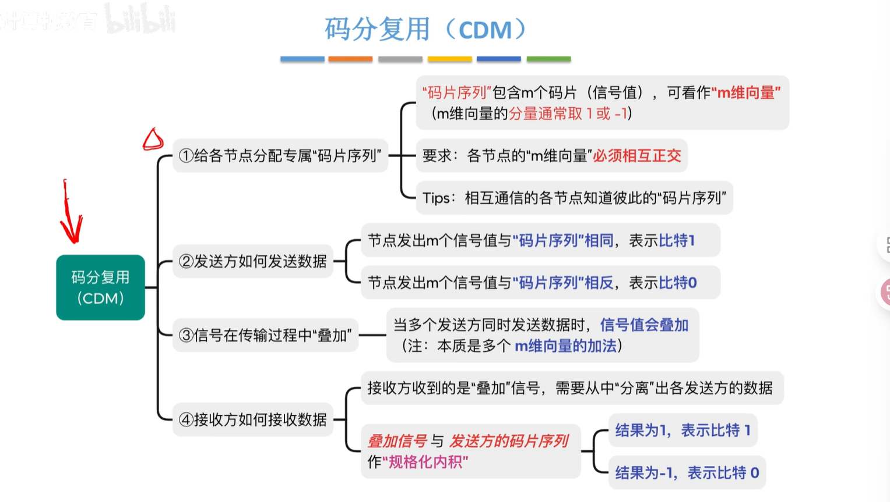
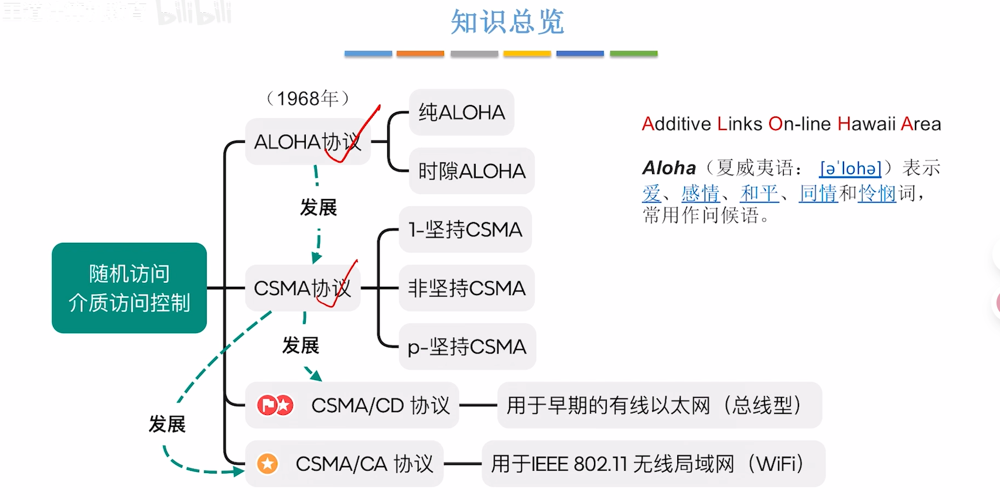

# 第三章 数据链路层

## 3.1 数据链路层的功能

> 

### 数据链路层所处的地位

- 使用物理层提供的比特传输的服务
- 为网络层提供服务，将**网络层的IP数据包（分组）**封装成**帧**，传输给下一个相邻结点
  - 物理链路：传输介质 + 物理层
  - 逻辑链路/数据链路

### 数据链路层的功能

- 组帧
- 差错控制
- 可靠传输
  - 丢失
  - 重复
  - 失序
- 流量控制
- 介质访问控制
  - 广播信道 需要实现
  - 点对点信道 

## 3.2 组帧

> 

网络层感知不到组帧的过程 也就是透明传输

### 组帧方法

#### 字符计数法

> 注意：帧长 = 计数字段长度 + 帧的数据部分长度

#### 字节填充法

SOH EOT

在数据部分前加入ESC转义字符 标记不是控制字符

#### 零比特填充法

发送方：每遇到连续五个1，就填充一个0

接收方：逆处理

> HDLC
>
> PPP协议用这种方法组帧

#### 违规编码法

基于曼彻斯特编码

需要物理层支持

中间不跳变则违规

---

## 3.3 差错控制

> 

### 3.3.1 检错编码 纠错编码

#### 奇偶校验码

- 奇校验码
  - 整个校验码（有效信息位+校验位）的 “1”个数为奇数
- **偶校验码**
  - 整个校验码（有效信息位+校验位）的 “1”个数为偶数
  - 求偶校验位：各信息异或后得到的结果为偶校验位
  - 进行偶校验：所有位进行异或，若结果为1说明出错

- 只能检测出奇数位的错误 无法纠错

#### CRC码 循环冗余校验码

约定一个除数

进行模二除运算 看余数是否与校验码相同

000：没有出错

010：代表c2出错？no！

k个信息位 R个校验位 2^R^ >= K+R+1 可纠正一位错

#### 海明码

2^k^ >= n + k + 1

校验位 P~i~ 放在海明位号为 2^i-1^

## 3.4 流量控制与可靠传输机制

> 

### 滑动窗口机制

发送窗口 W~T~

接收窗口 W~R~

**<u>接收方通过“确认机制”控制发送方的窗口向前移动</u>**

### 停止-等待协议 (S-W)

> 
>

#### 帧序号

- 只要把相邻的帧用编号区别开来就可以
- 1bit

#### 帧类型

- 数据帧
- 确认帧 ACK0 / ACK1

#### 异常情况

- 帧丢失

  - 数据帧丢失
    - 超时重传

  - 确认帧丢失

    - 接收到重复帧

      > ①丢弃重复帧
      >
      > ②返回重复帧的ACK

- 帧错误
  - 丢弃 不返回ACK

---

### 后退N帧协议 GBN go-back-n

> 

累积确认：连续收到多个数据帧，可以仅返回最后一个正确帧的ACK

#### 异常情况

- 数据帧丢失
  - 返回最后一个连续接收帧的ACK 
- 确认帧丢失
  - **超时的帧后面全部重传**
  - 收到非法帧的时候 返回目前接收的最后一个正确帧的ACK

> 如果不满足W~T~ + W~R~  <= 2^n^   ?
>
> 

---

也就是说如果一轮发送的帧有一个出现问题 那就要回退到第一个重新传这一轮所有的帧

### 选择重传协议 SR selective repeat

> 

请求重传：NAK

W~R~ < W~T~

实际应用中 W~R~ = W~T~

#### 异常情况

- 数据帧丢失
  - 超时重传对应帧
- 数据帧差错
  - NAK
- 确认帧丢失
  - 超时重传 收到重复帧（落到接收窗口之外）

---

### 三种协议的信道利用率分析

#### S-W 协议的信道利用率

#### GBN SR协议的信道利用率

`术语补充: 滑动窗口协议: GBN SR`
`ARQ协议：自动重传请求协议，包含S-W GBN SR`
`连续ARQ协议: GBN SR`

---

## 3.5 介质访问控制

> - 介质访问控制MAC
>   - 多个节点共享同一个“总线型”广播信道，可能发生信号冲突。
>
> > 应该如何控制各节点对传输介质的访问，才能减少冲突，甚至避免冲突？

### 3.5.1 信道划分 介质访问控制

> 

#### 时分复用 TDM

TDM帧：时间分成TDM帧 再分为m个时隙

- 缺点
  - 每个节点最多只能分配到信道总带宽的1/m
  - 时隙可能被闲置 信道利用率低
    - 可统计每个节点对信道的使用需求 动态按需时隙 -->==统计时分复用==

#### 统计时分复用 STDM

- /异步时分复用 在TDM基础上，动态按需分配时隙
- 时隙闲置问题会得到解决

#### 频分复用 FDM

如果两个信号频率区别很大，就很容易分辨出来

- 将信道的总频带划分为多个子频带，每个子频带作为一个子信道，每个用户用一个子信道进行通信

复用器：将信号复合

分用器：将信号分离

优缺点

- 节点可同时发送信号
- 只能用于模拟信号

#### 波分复用 WDM

- 光的频分复用
  - 光信号的频带范围/带宽非常大 所以适合用波分复用技术 把光纤拆分成多个子信道

---

#### 码分复用 CDM

> 2G 3G移动网络时代 节点与节点之间的通信常用CDMA技术
>
> 

**码片序列**

- 每个节点有自己的码片序列表示 1 / 0
- 各个节点的码片序列要**正交**
- 计算叠加信号值：规格化内积

---

### 3.5.2 随机访问 介质访问控制

> 
>

#### 纯ALOHA 时隙ALOHA

- 帧超时后随机等待一段时间在重传，这样发生冲突的两个帧下次重传时间就能错开
- 时隙ALOHA 
  - 时隙大小固定 避免了用户发送数据的随意性 降低了冲突概率

#### CSMA协议 载波监听多路访问协议

- 要求各个节点发送数据之前 监听信道是否空闲 只有空闲时才会尝试发送
  - 节点的网卡安装 载波监听装置

##### 1-坚持CSMA协议

准备好数据帧 就开始监听信道

- 优点：信道利用率高 信道一旦空闲 就可以被下一个节点使用
- 缺点：当多个节点都已准备好数据时，一旦信道空闲 大概率会发生冲突

##### 非坚持CSMA协议

如果监听到信道不空闲 就放弃监听一段随机时间 

- 优点：多个节点准备好数据 如果信道不空闲 各个节点随即推迟一段时间再尝试监听 从而使各节点错开发送数据 降低冲突概率
- 缺点：信道刚回复空闲 可能不会被立即利用 信道利用率会降低一些

##### p-坚持CSMA协议

一直监听，有p概率立即发送数据，1-p概率推迟一段时间再发

- 优点：属于1-坚持 非坚持CSMA的折中方案 降低冲突概率+提高信道利用率

---

---

#### ==CSMA/CD协议== 冲突检测

 用于早期的有限以太网 总线型

##### 协议要点

- 先听后发 边听边发 冲突停发 随机重发
  - 如果信道不空闲 那就坚持监听；信道空闲立即发送数据
    - 1-坚持
  - 一边自己发数据 一边监听 如果发送中检测到冲突 就会停止发送
    - 第16次冲突 放弃传输 报告网络层；k<=15 随机等待一段时间再发送--><u>截断二进制指数退避算法</u>
    - 如果发送中没有检测到冲突

##### 如何随机重发？

- 截断二进制指数退避算法
  - 随机等待一段时间 = r倍争用期 ，其中r为随机数
  - 如果k<=10，在[0~2^k^-1] 取一个随机数r；如果k>10，在[0~2^10^-1]取一个随机数r；

##### 争用期

- 争用期 = `2 * 最大单向传播时延（考虑距离最远的两个节点）`

  - 最极限能检测到冲突的时间

##### 最短帧长

- 最短帧长 = `2 * 最大单向传播时延 * 信道带宽` 
  - 如果数据帧很小 要填充

==CSMA/CD没有ACK机制，若发送过程中未检测到冲突，就认为帧发送成功==

##### 最长帧长

- 规定最长帧长可以防止某些节点一直占用信道
- 以太网规定：`最短帧长 = 64B 最长帧长 = 1518B`

#### CSMA/CA协议

用于IEEE 802.11无限局域网 WiFi

> 

##### AP

- 接入点（无限wifi热点 固定站点）

##### 不能采用CSMA/CD协议

##### 协议要点

- 发送方：先听后发，忙则退避

  - 若信道空闲，`间隔DIFS`后，再发送帧 （一口气发完 发送过程中不用检测冲突）
    - DIFS：最长的帧间间隔
    - SIFS：最短的帧间间隔（用于处理收到的帧 比如差错控制）
    - PIFS
    - DIFS > PIFS > SIFS

  - 若信道不空闲，则进行`随机退避`
    - 用奇妙的`二进制指数退避算法`确定一个倒计时`随即退避时间`
    - 发送方保持监听，只有信道空闲时才扣除倒计时，倒计时结束立刻发送帧（此时信道一定空闲）

- 接收方：停止等待协议
  - 每收到一个正确数据帧都返回ACK
  - 若发送方超时未收到ACK，则进行`随机退避`
- 解决`隐蔽站`的问题：`信道预约机制` （可选）
  - 发送方广播RTS控制帧 预约（超时每收到CTS依然随机退避）
  - AP广播CTS控制帧（已约勿扰）
  - 其他无关节点收到CTS后自觉禁言
  - 发送方收到CTS就可以发送数据帧
  - AP接收 校验 返回ACK帧

---

### 3.5.3 令牌传递协议

> 环形拓扑结构 各节点“轮询访问”信道，不会发生信道冲突
>
> 如何实现“介质访问控制”？令牌传递协议

#### 工作原理

每次只能传一个帧 传完生成新令牌交给下一个节点

帧和令牌只能单向传递

#### MAU——用于集中控制“令牌环网”

---

## 3.6 局域网

### 3.6.0 局域网与IEEE 802

### 3.6.1局域网的基本概念与体系结构

### 3.6.2 以太网与IEEE 802.3

### 3.6.3 VLAN的基本概念与基本原理

### 3.6.4 IEEE 802.11 无线局域网

## 3.7 广域网

## 3.8 以太网交换机

